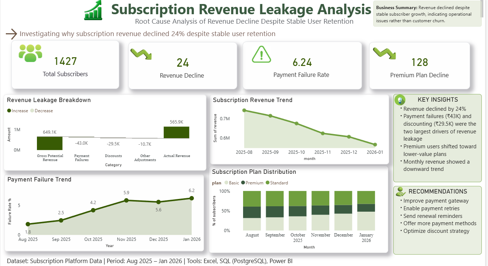

# subscription-revenue-leakage-analysis
## Dashboard

## Problem
A subscription platform's active user base remained stable (~1,400–1,500 users/month)
over a 6-month period (Aug 2025 – Jan 2026), yet recurring revenue declined by ~24%
over the same window — a pattern masked by flat user-count reporting.

## Objective
Identify and quantify the specific causes of revenue leakage, and reconcile them
against total actual revenue, to support targeted retention and pricing decisions.

## Approach
1. Excel / Power Query — cleaned raw transaction data: standardized inconsistent
   date formats, fixed plan-name casing/spacing, removed duplicates, handled nulls
   and invalid values.
2. SQL (PostgreSQL) — queried the cleaned dataset to isolate revenue drivers:
   plan mix shift, payment failure rate, discount usage, and a reconciled revenue
   bridge (see queries.sql).
3. Power BI — built a dashboard with KPI summary cards, trend visuals, and a
   waterfall (revenue bridge) chart quantifying leakage by cause.
4. BRD — documented business objective, scope, stakeholders, and requirements
   before analysis.

## Key Findings
- Revenue declined ~24% (₹7.4L → ₹5.7L) while user count stayed flat at ~1,400–1,500
- Premium plan users dropped from 410 to 282 (31% decline), with users shifting
  toward lower-value Basic plans
- Payment failure rate more than tripled, from 1.8% to 6.2%
- Of the ₹83K January shortfall: ~₹43K came from payment failures, ~₹29.5K from
  discounting, with the remainder attributed to compounding/edge-case effects

## Recommendations
- Improve payment gateway reliability; enable automatic payment retries
- Send proactive renewal/failed-payment reminders
- Offer additional payment methods to reduce failure-driven churn
- Review discount eligibility criteria to reduce margin erosion

## Tools
Excel (Power Query) | SQL (PostgreSQL) | Power BI
